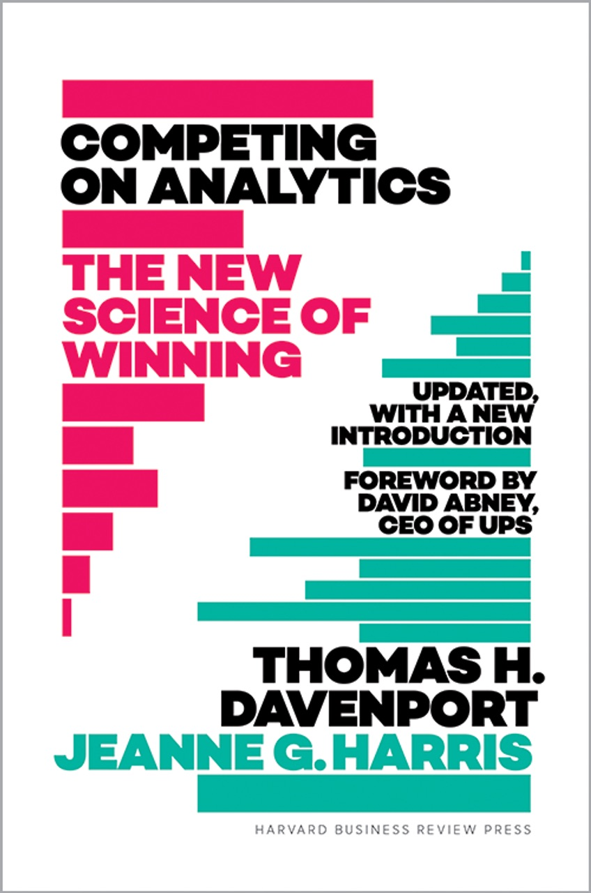

## 📚 **Data-Insight-Tools:  Analytics & Predictive Methods**

This repository is a **list of educational resources and tools** I have gathered over time from various courses, books, and training programs related to **data analytics and predictive methodologies**. Despite the abundance of content in this field, I found that a **comprehensive, well-structured resource** was missing—so I decided to create one! 🚀  

### 🎯 **My Goal:**
I aim to gradually enrich this repository by adding **real-world examples and Python code** for each method, making it a go-to reference for anyone who wants to **enter the world of data analytics**. This collection covers everything from **anomaly detection, trend forecasting, and segmentation** to **causal inference, risk assessment, and ethical AI**—designed to help aspiring data professionals build a solid foundation.

### 🔥 **Why This Repository?**
- 📈 **Comprehensive Coverage:** A single source that spans multiple domains of data analytics.
- 💡 **Practical Focus:** Real-life examples and reproducible code to aid learning.
- 🎓 **For All Levels:** Useful for beginners entering the field and professionals looking to deepen their expertise.

Stay tuned as I continue to **expand and refine** this resource—your contributions, feedback, and suggestions are always welcome! 🙌
#### 🙌 Sajjad Fakhatian

## Table of Contents
- [Overview](#overview)
- [The Insight Weaver](#the-insight-weaver)
- [The Anomaly Hunter](#the-anomaly-hunter)
- [The Trend Forecaster](#the-trend-forecaster)
- [The Segment Architect](#the-segment-architect)
- [The Association Mapper](#the-association-mapper)
- [The Causal Connector](#the-causal-connector)
- [The Risk Assessor](#the-risk-assessor)
- [The Pattern Recognizer](#the-pattern-recognizer)
- [The Sentiment Analyzer](#the-sentiment-analyzer)
- [The Network Weaver](#the-network-weaver)
- [The Feature Engineer](#the-feature-engineer)
- [The Bias Detector](#the-bias-detector)
- [The Storyteller](#the-storyteller)
- [The Decision Optimizer](#the-decision-optimizer)
- [The Uncertainty Navigator](#the-uncertainty-navigator)
- [The Feedback Loop Designer](#the-feedback-loop-designer)
- [The Ethical Guardian](#the-ethical-guardian)
- [The Hypothesis Tester](#the-hypothesis-tester)
- [The Knowledge Amplifier](#the-knowledge-amplifier)
- [The Visionary Innovator](#the-visionary-innovator)
- [License](#license)
- [Contributing](#contributing)

## Overview
This repository aggregates top-tier books, seminal papers, and practical online resources that span the full spectrum of data-driven analytics. Whether you're building courses, tackling real-world projects, or diving into research, you'll find a wealth of material to empower your journey in analytics and AI.

---

## The Insight Weaver
**Focus:** Crafting compelling data narratives  
**Key Resource:** [*Storytelling with Data* by Cole Nussbaumer Knaflic](https://www.google.com/books/edition/Storytelling_with_Data/rRSRCgAAQBAJ?hl=en&gbpv=1&printsec=frontcover) 
  

 

Learn how to transform complex data into engaging stories that drive impact.

**📚 More details**
- [The Insight Weaver: Crafting Compelling Data Narratives](./Insight_Weaver_Guide.md)
- Project examples (Coming soon!)
 

---

## The Anomaly Hunter
**Focus:** Detecting outliers and irregularities  
**Key Resource:** [“Anomaly Detection: A Survey” by Chandola et al. (2009)](http://cucis.ece.northwestern.edu/projects/DMS/publications/AnomalyDetection.pdf)
  

 

Explore comprehensive techniques to uncover hidden risks in your data.

**📚 More details**
- [The Anomaly Hunter: Detecting outliers and irregularities](./The_Anomaly_Hunter.md)
- Project examples (Coming soon!)
 

---

## The Trend Forecaster
**Focus:** Predicting future events  
**Key Resource:** [*Forecasting: Principles and Practice* by Hyndman & Athanasopoulos](https://otexts.com/fpp3/index.html)
  

 

Master modern forecasting techniques with practical examples in R.

**📚 More details**
- [The Trend Forecaster: Predicting future events](./Forecasting_Methods.md)
- Project examples (Coming soon!)
 

---

## The Segment Architect
**Focus:** Data segmentation and clustering  
**Key Resource:** [*Data Mining: Concepts and Techniques* by Han, Kamber, & Pei](https://myweb.sabanciuniv.edu/rdehkharghani/files/2016/02/The-Morgan-Kaufmann-Series-in-Data-Management-Systems-Jiawei-Han-Micheline-Kamber-Jian-Pei-Data-Mining.-Concepts-and-Techniques-3rd-Edition-Morgan-Kaufmann-2011.pdf)
  

 

Dive into methodologies for discovering meaningful groups within your data.

**📚 More details**
- [The Segment Architect: Data segmentation and clustering](./Data_Segmentation_and_Clustering.md)
- Project examples (Coming soon!)
 

---

## The Association Mapper
**Focus:** Uncovering associations and dependencies  
**Key Resource:** [*Association rule mining chapter in *Data Mining: Concepts and Techniques*](https://myweb.sabanciuniv.edu/rdehkharghani/files/2016/02/The-Morgan-Kaufmann-Series-in-Data-Management-Systems-Jiawei-Han-Micheline-Kamber-Jian-Pei-Data-Mining.-Concepts-and-Techniques-3rd-Edition-Morgan-Kaufmann-2011.pdf)
  

 

Learn to map relationships and uncover market basket insights.

**📚 More details**
- [The Association Mapper: Uncovering associations and dependencies](./Association_Rule_Mining.md)
- Project examples (Coming soon!)
 

---

## The Causal Connector
**Focus:** Inferring cause and effect  
**Key Resource:** [*Causal Inference in Statistics: A Primer* by Pearl et al.](https://www.google.com/books/edition/Causal_Inference_in_Statistics/L3G-CgAAQBAJ?hl=en)
  

 

Understand the fundamentals of causal reasoning in data.

**📚 More details**
- [The Causal Connector: Inferring cause and effect ](./Causal_Connector.md)
- Project examples (Coming soon!)
 

---

## The Risk Assessor
**Focus:** Quantifying and managing risk  
**Key Resource:** [*Quantitative Risk Management* by McNeil, Frey, & Embrechts](https://www.google.com/books/edition/Quantitative_Risk_Management/SfJnBgAAQBAJ?hl=en&gbpv=1&printsec=frontcover)
  

 

Gain deep insights into risk modeling for finance, insurance, and beyond.

**📚 More details**
- [The Risk Assessor: Quantifying and managing risk](./Quantitative_Risk_Management.md)
- Project examples (Coming soon!)
 

---

## The Pattern Recognizer
**Focus:** Identifying recurring patterns  
**Key Resource:** [*Pattern Recognition and Machine Learning* by Bishop](https://www.microsoft.com/en-us/research/wp-content/uploads/2006/01/Bishop-Pattern-Recognition-and-Machine-Learning-2006.pdf)
  

 

Learn the mathematical foundations behind effective pattern detection.

**📚 More details**
- [The Pattern Recognizer: Identifying recurring patterns](./Pattern_Recognition_Methods.md)
- Project examples (Coming soon!)
 

---

## The Sentiment Analyzer
**Focus:** Extracting sentiment from text  
**Key Resource:** [*Sentiment Analysis: Mining Opinions, Sentiments, and Emotions* by Bing Liu](https://www.cs.uic.edu/~liub/FBS/SentimentAnalysis-and-OpinionMining.pdf)
  

 

Get a comprehensive look at analyzing emotions in unstructured text.

**📚 More details**
- [The Sentiment Analyzer: Extracting sentiment from text](./Sentiment_Analysis.md)
- Project examples (Coming soon!)
 

---

## The Network Weaver
**Focus:** Modeling relationships in networks  
**Key Resource:** [*Networks, Crowds, and Markets* by Easley & Kleinberg](https://www.cs.cornell.edu/home/kleinber/networks-book/networks-book.pdf)
  

 

Unravel the complexities of network structures and connectivity.

**📚 More details**
- [The Network Weaver: Modeling relationships in networks](./Modeling_Relationships_in_Networks.md)
- Project examples (Coming soon!)
 

---

## The Feature Engineer
**Focus:** Designing powerful predictive features  
**Key Resource:** [*Feature Engineering for Machine Learning* by Zheng & Casari](https://www.google.com/books/edition/Feature_Engineering_for_Machine_Learning/sthSDwAAQBAJ?hl=en&gbpv=1&printsec=frontcover)
  

 

Enhance your models by transforming raw data into robust features.

**📚 More details**
- [The Feature Engineer: Designing powerful predictive features](./Predictive_Modeling.md)
- Project examples (Coming soon!)
 

---

## The Bias Detector
**Focus:** Identifying and mitigating bias  
**Key Resource:** [*Fairness and Machine Learning* by Barocas, Hardt, & Narayanan](https://fairmlbook.org/)
  

 

Discover strategies to build fair and ethical AI systems.

**📚 More details**
- [The Bias Detector: Identifying and mitigating bias](./Bias_Detection.md)
- Project examples (Coming soon!)
 

---

## The Storyteller
**Focus:** Visualizing and communicating insights  
**Key Resource:** [*Good Charts* by Scott Berinato](https://store.hbr.org/product/good-charts-updated-and-expanded-the-hbr-guide-to-making-smarter-more-persuasive-data-visualizations/10637?srsltid=AfmBOopEh8xBxwhKN7i-bGs0_CNQeOA2BMbQydDizKe5DdFjve8UFzxa)
  

 

Learn how to create persuasive visual data narratives.

**📚 More details**
- [The Storyteller: Visualizing and communicating insights](./Art_and_Science_of_Data_Storytelling.md)
- Project examples (Coming soon!)
 

---

## The Decision Optimizer
**Focus:** Data-driven decision making  
**Key Resource:** [*Data Science for Business* by Provost & Fawcett](https://www.google.com/books/edition/Data_Science_for_Business/4ZctAAAAQBAJ?hl=en)
  

 

Bridge the gap between analytics and actionable business decisions.

**📚 More details**
- [The Decision Optimizer: Data-driven decision making](./Art_and_Science_of_Data_Storytelling.md)
- Project examples (Coming soon!)
 

---

## The Uncertainty Navigator
**Focus:** Managing uncertainty in predictions  
**Key Resource:** [*Uncertainty Quantification* by Ralph C. Smith](https://rsmith.math.ncsu.edu/UQ_TIA/)
  

 

Navigate the challenges of prediction errors and risk.

**📚 More details**
- [The Uncertainty Navigator: Managing uncertainty in predictions](./Uncertainty_Quantification_in_Predictive_Modeling.md)
- Project examples (Coming soon!)
 

---

## The Feedback Loop Designer
**Focus:** Building iterative, adaptive systems  
**Key Resource:** [*Continuous Delivery* by Humble & Farley](https://www.google.com/books/edition/Continuous_Delivery/6ADDuzere-YC?hl=en&gbpv=1&pg=PT29&printsec=frontcover)
  

 

Design robust feedback systems to constantly improve performance.

**📚 More details**
- [The Feedback Loop Designer: Building iterative, adaptive systems](./Feedback_Loops.md)
- Project examples (Coming soon!)
 

---

## The Ethical Guardian
**Focus:** Ensuring ethical AI practices  
**Key Resource:** [*Weapons of Math Destruction* by Cathy O’Neil](https://www.google.com/books/edition/Weapons_of_Math_Destruction/CxD-DAAAQBAJ?hl=en&gbpv=1&pg=PR3&printsec=frontcover)
  

 

Understand the societal impact of algorithms and safeguard fairness.

**📚 More details**
- [The Ethical Guardian: Ensuring ethical AI practices](./Ethical_Risks_in_AI_System.md)
- Project examples (Coming soon!)
 

---

## The Hypothesis Tester
**Focus:** Rigorous statistical testing of model assumptions  
**Key Resource:** [*Statistical Inference* by Casella & Berger](https://pages.stat.wisc.edu/~shao/stat610/Casella_Berger_Statistical_Inference.pdf)
  

 

Master the art of hypothesis testing in data science.

**📚 More details**
- [The Hypothesis Tester: Rigorous statistical testing of model assumptions](./hypothesis_testing.md)
- Project examples (Coming soon!)
 

---

## The Knowledge Amplifier
**Focus:** Extracting actionable insights  
**Key Resource:** [*Data Mining: Concepts and Techniques* by Han, Kamber, & Pei](https://myweb.sabanciuniv.edu/rdehkharghani/files/2016/02/The-Morgan-Kaufmann-Series-in-Data-Management-Systems-Jiawei-Han-Micheline-Kamber-Jian-Pei-Data-Mining.-Concepts-and-Techniques-3rd-Edition-Morgan-Kaufmann-2011.pdf)
  

 

Convert raw data into valuable, actionable knowledge.

**📚 More details**
- [The Knowledge Amplifier: Extracting actionable insights ](./Extracting_Actionable_Insights_from_Data.md)
- Project examples (Coming soon!)
 

---

## The Visionary Innovator
**Focus:** Leveraging emerging analytics trends  
**Key Resource:** [*Competing on Analytics* by Davenport & Harris](https://www.google.com/books/edition/Competing_on_Analytics_Updated_with_a_Ne/LW9GDgAAQBAJ?hl=en)
  

 

Learn how innovative analytics drive competitive advantage.

**📚 More details**
- [The Visionary Innovator: Leveraging emerging analytics trends](./Leveraging_Analytics_for_Competitive_Advantage.md)
- Project examples (Coming soon!)
 

---
---

## License
This repository is licensed under the MIT License. See the [LICENSE](LICENSE) file for more details.

## Contributing
Contributions are welcome! Please read the [CONTRIBUTING](CONTRIBUTING.md) guidelines before submitting a pull request.

---

Feel free to explore, contribute, and use these resources to elevate your data analytics and predictive modeling journey.
